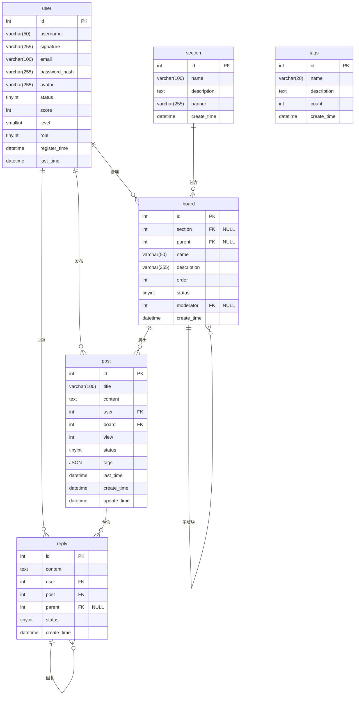

# Fourm Project

现需要设计一款轻量化论坛系统。针对该系统，应当包含以下基本内容与模块：
1.用户管理
    - 用户注册、登录、个人信息管理
    - 用户权限分级（普通用户、版主、管理员）
    - 用户积分/等级系统
2.论坛内容管理
    - 分区管理
    - 板块管理
    - 帖子发布、编辑、删除
    - 回复功能
3.内容展示 (通过标签实现)
    - 热门帖子
    - 最新帖子
    - 精华帖
4.系统管理
    - 内容审核
    - 用户封禁

## 功能实体

基于上述功能内容，可解构主要实体有：
- 用户：一切功能的操作者与负责人。包含用户ID、用户名、密码(加密)、邮箱、头像、注册时间、最后登录时间、状态、积分、等级、身份和签名。
- 大区：论坛的基本分区，用于隔离不同的讨论内容。包括ID、论坛名称、开放日期、简介、封面图。
- 板块：大区内的独立板块，用于展示不同的内容，方便用户选择。包括版块ID、版块名称、描述、父版块ID、大区ID(关联)、排序、状态。
- 帖子：基本的内容实体，包括帖子ID、标题、内容、发帖用户ID、版块ID、发布时间、最后编辑时间、查看数、状态。
- 回复：单个帖子下的内容，包括回复ID、内容、回复用户ID、帖子ID、回复时间、引用回复ID、状态。
- 标签：用于标记帖子类型，实际包括标签ID、标签名称、创建时间等。

## 数据库ER图

## 后续优化

该数据库设计采用了多层次的性能优化策略。额外的，在后续开发与运营中，对于数据量大的表（如回复、私信），应当采用按时间或哈希分表策略；同时，应当通过读写分离将高频查询的表（如帖子、回复）分配到读库。还可以额外利用Redis，对热门帖子和用户信息等高频访问数据进行缓存，减轻数据库压力，提高访问速度。对帖子表按版块ID进行分区优化查询效率。